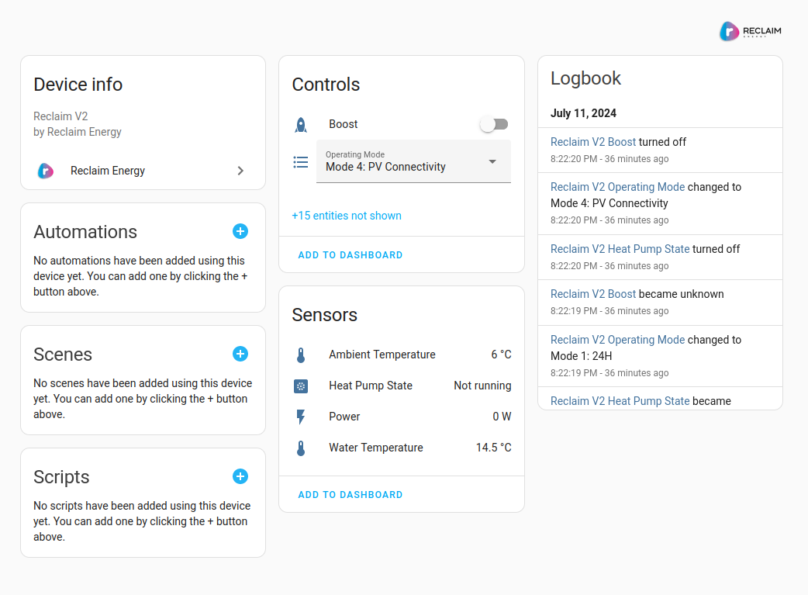

# Reclaim Energy Heat Pump (v2) Integration

This integration supports heat pump hot water systems from Reclaim Energy which
use the wifi-enabled "v2" controller.

It currently exposes the following entities:

- Water Temperature (at bottom sensor)
- Ambient Temperature
- Heat Pump State (Running / Not Running)
- Power
- Boost switch (Current boost state and ability to turn boost on and off)

Additional sensors and controls are also available, but disabled by default.

To integrate the Power sensor into the energy dashboard, use the "Integral
Sensor" helper to create a Left Riemann sum sensor based on the reclaim power
sensor, this will produce accumulating KWh for use in energy dashboard.

# Installation

The simplest method is using 'HACS':

- Go to HACS / Integrations
- Click the 3 dots in the top right
- Select "Custom repositories"
- Add the repository URL
- Select category Integration
- Click ADD
- Now from HACS / Integrations you can find Reclaim Energy and click Download
- Restart Home Assistant

Now you can add the integration using the ADD INTERGATION button in Settings / Devices & services, search for Reclaim Energy.
It will ask you for your Unique Device ID. This is the 17 digit number found on the sticker on the controller or with the instruction booklet.
